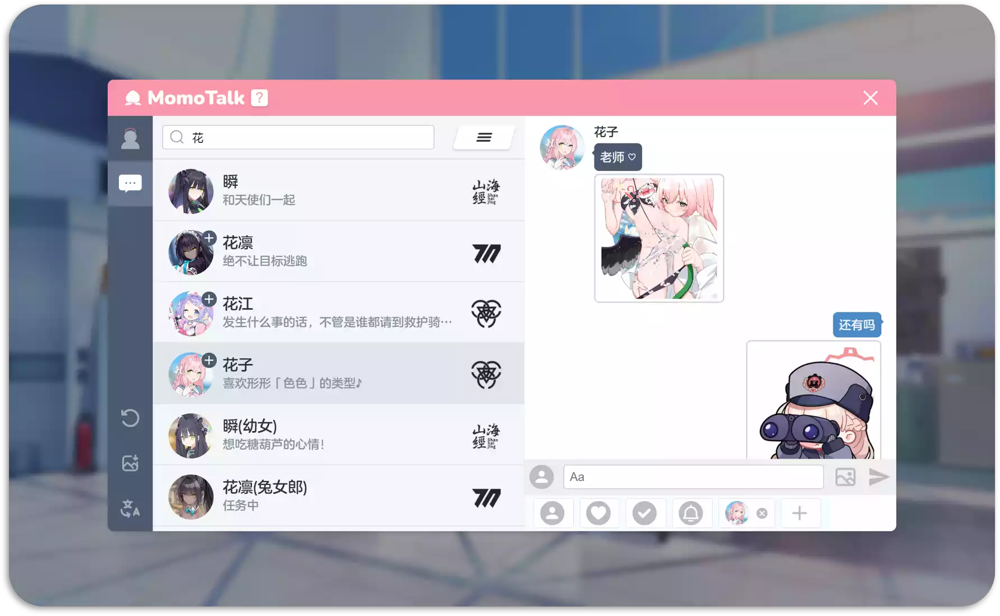
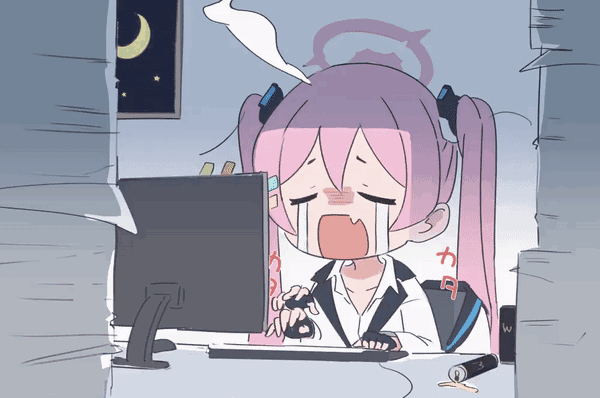

# 食用说明 · How to use

## 📚侧边栏 · Sidebar 

💾 侧边栏下方三个按钮分别是「**切换语言**」「**重置**」和「**下载**为图片」

Below, there are three buttons: "**Switch languages**", "**Reset**" and "**Download** as image". 

## 🎓学生列表 · Student List 

🔍 点击右侧的**学校标志**，筛选学校；上方的**搜索栏**（快捷键 `/`），支持汉字、罗马音，以及游戏黑话 

Click on the **school icons**: Filter students by school. **Search bar** at the top(Shortcut key `/`), supports use Chinese , romaji as keywords

 

📜 搜索栏右侧的按钮：在「已实装角色」和「未实装角色」之间**切换列表** 

Clicking the button on the right side of the search bar allows you to toggle between the "Implemented Characters" and "Unimplemented Characters" lists

🔄 头像标着 `+` 的学生：点击头像切换 **差分** 

Students with a \`+\` on their avatars: Click on the avatar to switch **appearances**.

📝 进入编辑界面后，点选学生列表可以将学生加入右下角的候选列表，方便后续使用 

Upon entering the editing interface, selecting students from the list will add them to the candidate list in the bottom right corner for easy access

## 🖌️编辑界面 · Edit

在编辑界面，下方分别是「发送栏」和「候选列表」 

In the editing interface, there are the "Message Bar" and the "Candidate List" at the bottom

### 🎭 选择身份 · Select a Role

候选列表前四项为「**老师**」「**羁绊剧情**」「**回复**」「**系统消息**」，最后一个按钮用于**添加自定义角色** 

The first four items in the candidate list are "**Sensei**", "**Story Event**", "**Reply Box**", and "**System Message**". The last button is for **adding custom characters**.

### 🌄 发送消息 · Send Messages

选择身份后在发送栏**发送消息或图片**（大小限制为 1MB）

老师和学生身份，点击发送栏的头像能够发送游戏中的聊天室**贴图** 

After selecting a role, you can **send messages or images** in the message bar (size limit is 1MB). If the current role is a teacher or student, clicking on the avatar in the message bar allows you to send in-game chatroom **stickers**

### ✏️ 编辑消息 · Edit Messages

遵循 **所见即所得** 的设计思想，消息发送后仍可以对元素直接编辑，如修改、拖拽、删除等 

- **修改**：
  - 点选 *文本* 或者 *角色名字* 会出现文本框，在其中编辑即可
  - 对于 *图片* 消息，点击后重新上传图片
  - *回复* 键入回车会出现下一个选项框
- **拖拽**：按住消息上下移动可以调整消息之间的顺序
- **删除**：光标 *停留* 在元素上时，出现 \`x\` 删除按钮
- **快捷键**：撤销 `Ctrl+Z`，重做 `Ctrl+Shift+Z`, 软换行 `Shift+Enter`

Following the **WYSIWYG** (What you see is what you get) design philosophy, elements can still be directly edited after sending messages, such as modifying, dragging, deleting, etc. 

- **Modifying**: Supports editing *text*, *character names*, and *images*.
  - For " *Reply* ", pressing Enter will bring up the next option.
- **Dragging**: Holding and moving messages up and down can adjust the order between messages.
- **Deleting**: When the cursor *hovers* over an element, a delete button `x` will appear near the element.
- **Shortcut key**: undo `Ctrl+Z`, redo `Ctrl+Shift+Z`, and line break `Shift+Enter`

### 📜 中断消息流 ·  Interrupt the Message Flow

通常单个学生的消息是连续的。如果想要中断消息流，可以尝试点击学生消息中“头像”下方的区域。

Normally, messages from a single student are continuous. If you wish to interrupt the message flow, you can try clicking below the "avatar" in the student's message.

via <a href="https://twitter.com/YuzuTalkJP/status/1421448297030381569">Yuzutalk</a> 

## 🌟 其他

本应用适配移动端，但是因为能力有限，基本就是看看得了的程度，更推荐电脑操作 💻📱

The application is adapted for mobile devices, but due to limited capabilities, it's recommended to use it on a computer for a better experience 💻📱

 

游戏黑话搜索也是，如果发现有遗漏或者写错的，**欢迎提 [issue](https://github.com/U1805/momotalk/issues) 或 [pr](https://github.com/U1805/momotalk/pulls) 补充**，当然对功能和代码的好想法和优化也欢迎欢迎 ❤️

The game slang search is the same. If you notice any omissions or mistakes, **please feel free to raise an [issue](https://github.com/U1805/momotalk/issues) or submit a [pull request](https://github.com/U1805/momotalk/pulls) for correction**. Of course, ideas and optimizations for features and code are also very much welcomed ❤️

