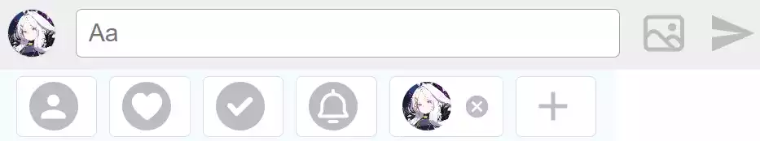
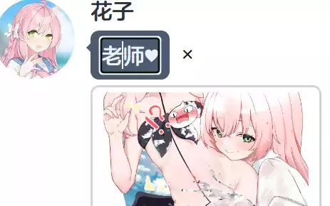
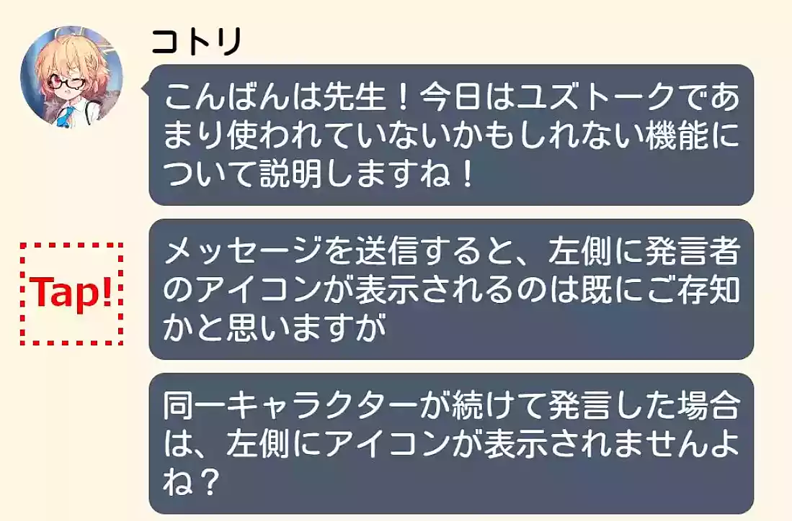

# 食用说明 · How to use

## 📚侧边栏 · Sidebar 

侧边栏上方两个按钮为界面切换，其中第二个是主要功能界面（编辑界面）

Two buttons at the top of the sidebar are for interface switching, with the second one being the main functional interface (editing interface)

 

下方三个按钮分别是「**切换语言**」「**重置**」和「**下载**为图片」，另外数据会实时保存本地，一般不用担心数据丢失 💾

Below, there are three buttons: "**Switch languages**" "**Reset**" and "**Download** as image". Additionally, the data is continuously saved locally, so there's usually no need to worry about data loss. 💾

## 🎓学生列表 · Student List 

学生列表中快速查找学生有两种方式，一种是点击右侧的**学校标志**，这会筛选出相同学校的学生；另一种是在上方的**搜索栏**中搜索，可以使用汉字、罗马音，以及可以尝试使用游戏中的黑话作为关键词 🔍

There are two ways to quickly find students in the student list. One is to click on the **school icons** on the right side, which filters students from the same school. The other is to use the **search bar** at the top, where you can use Chinese , romaji, and even try using in-game slang as keywords 🔍

 

点击搜索栏右侧的按钮可以在「已实装角色」和「未实装角色」之间**切换列表** 📜

Clicking the button on the right side of the search bar allows you to toggle between the "Implemented Characters" and **"Unimplemented Characters" lists** 📜

 

列表中头像标着 `+` 的学生，说明有多个**差分**可以使用，点击头像进行切换 🔄

Students in the list with a `+` on their avatars have **multiple variations** that can be used. Click on the avatar to switch between them 🔄

 

进入编辑界面后，点选学生列表可以将学生加入右下角的候选列表，方便后续使用 📝

Upon entering the editing interface, selecting students from the list will add them to the candidate list in the bottom right corner for easy access 📝

## 🖌️编辑界面 · Edit Container 

在编辑界面，下方分别是「发送栏」和「候选列表」 📋

In the editing interface, there are the "Message Bar" and the "Candidate List" at the bottom 📋

 

### 选择身份 · Select a Role

候选列表前四项为「**老师**」「**羁绊剧情框**」「**单选框**」「**系统消息**」，可以和学生一样作为发送消息的身份，最后一个按钮用于**添加自定义角色** 🎭

The first four items in the candidate list are "**Sensei**", "**Story Box**", "**Choices Button**", and "**System Message**". These can be used as message senders just like students. The last button is for **adding custom characters** 🎭

 

### 发送消息 · Send Messages

选择身份后可以尝试在发送栏**发送消息或图片**（大小限制为 1MB），如果当前身份是老师或者学生，点击发送栏的头像能够发送游戏中的聊天室**贴图** 🌄

After selecting a role, you can attempt to **send messages or images** in the message bar (size limit is 1MB). If the current role is a teacher or student, clicking on the avatar in the message bar allows you to send in-game chatroom **stickers** 🌄

 

### 编辑消息 · Edit Messages

遵循 **所见即所得** 的设计思想，消息发送后仍可以对元素直接编辑，如修改、拖拽、删除等 ✏️

- **修改**：点选「文本」或者「角色名字」会出现文本框，在其中编辑即可；对于「图片」消息，点击后会请求重新上传图片；「回复」类型的消息在文本框中键入回车会出现下一个选项
- **拖拽**：按住消息上下移动可以调整消息之间的顺序
- **删除**：当光标停留在元素上时，元素旁边会出现 `x` 的删除按钮

Following the **WYSIWYG** (What you see is what you get) design philosophy, elements can still be directly edited after sending messages, such as modifying, dragging, deleting, etc. ✏️

- **Modifying**: Clicking on "Text" or "Character Name" will bring up a text box, where you can edit directly. For "Image" messages, clicking will prompt to re-upload the image. For "Reply" type messages, pressing Enter in the text box will bring up the next option.
- **Dragging**: Holding and moving messages up and down can adjust the order between messages.
- **Deleting**: When the cursor hovers over an element, a delete button `x` will appear near the element.

 

### 中断消息流 ·  Interrupt the Message Flow

通常单个学生的消息是连续的。如果想要中断消息流，可以尝试点击学生消息中“头像”下方的区域。

Normally, messages from a single student are continuous. If you wish to interrupt the message flow, you can try clicking below the "avatar" in the student's message.

 参考自 Yuzutalk 

## 其他 🌟📋

本应用适配移动端，但是因为能力有限，基本就是看看得了的程度，更推荐电脑操作 💻📱

The application is adapted for mobile devices, but due to limited capabilities, it's recommended to use it on a computer for a better experience 💻📱

 

游戏黑话搜索也是，如果发现有遗漏或者写错的，欢迎提 issue 或 pr 补充，当然对功能和代码的好想法和优化也欢迎欢迎 🙌

The game slang search is the same. If you notice any omissions or mistakes, please feel free to raise an issue or submit a pull request for correction. Of course, ideas and optimizations for features and code are also very much welcomed 🙌

