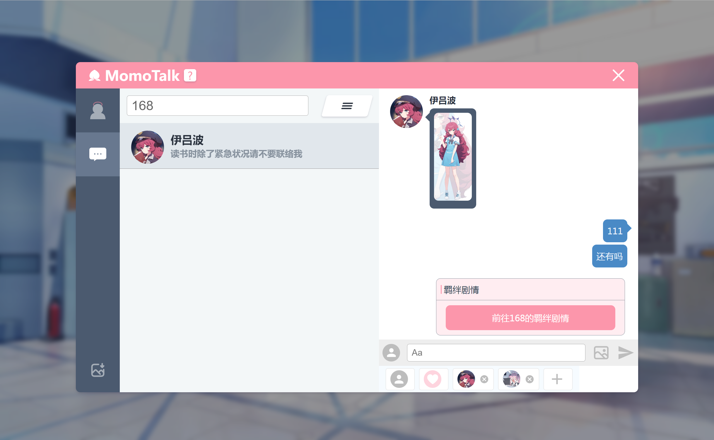
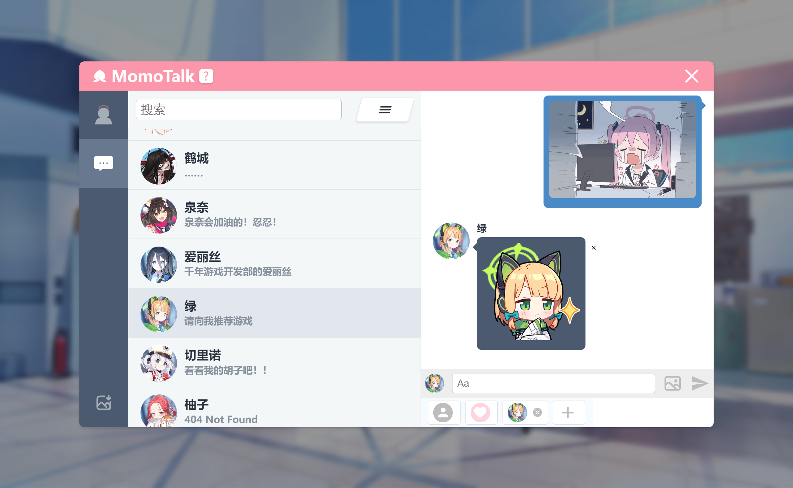

<h1 align="center">Momotalk 编辑器</h1>

    
    
    

  <strong>一个网页端的碧蓝档案聊天对话生成器</strong> 
  来创造脑洞大开的故事吧！

## 特性

- **可搜索学生**: 能够通过学生名字、名字罗马音，甚至游戏黑话快速搜索学生. 🔍️
- **自定义角色**: 发言角色包括老师、学生，也可以上传图片自定义角色. 🎅
- **消息类型丰富**: 除了文字还能发送图片、贴图和羁绊剧情框. ❤️
- **灵活的编辑**: 聊天框可随意插入、删除、编辑、拖动位置. 👍
- **便于分享**: 对话可以保存为图片方便分享给小伙伴. 🖼️

[等不及了快端上来吧！](https://u1805.github.io/momotalk)

## 预览

## Star

喜欢的话请点点Star，谢谢喵=\^ω\^=

## 感谢

项目参考自:

- [Yuzutalk](https://www.yuzutalk.net/)
- [Slouchwind/momotalk-editor](https://github.com/Slouchwind/momotalk-editor)
- [blacktunes/juus-maker](https://github.com/blacktunes/juus-maker)
- [ClosureTalk/closure-talk](https://github.com/ClosureTalk/closure-talk)

角色数据来源:

- [lonqie/SchaleDB](https://github.com/lonqie/SchaleDB)
- [Ba.Gamekee](https://ba.gamekee.com/)

## 版权

项目中角色、素材版权均属于 Yostar & NEXON Games