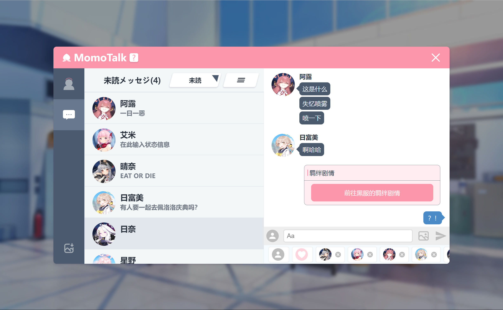

# Momotalk

Momotalk Editor

Now it looks like

## Quick start

## Credits

This project is inspired by:

- [Yuzutalk](https://www.yuzutalk.net/)
- [Slouchwind/momotalk-editor](https://github.com/Slouchwind/momotalk-editor): A Web MomoTalk Editor
- [blacktunes/juus-maker](https://github.com/blacktunes/juus-maker)
- [ClosureTalk/closure-talk](https://github.com/ClosureTalk/closure-talk)

Character metadate from:

- [lonqie/SchaleDB](https://github.com/lonqie/SchaleDB)

## Copyrights

Blue Archive avatar and stamp copyrights belong to Yostar & NEXON Games