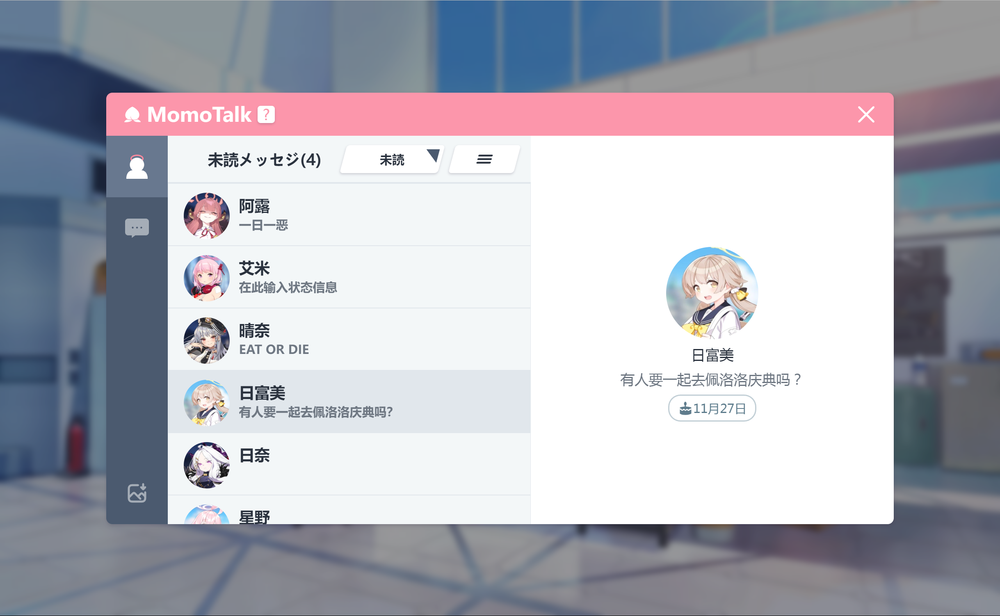
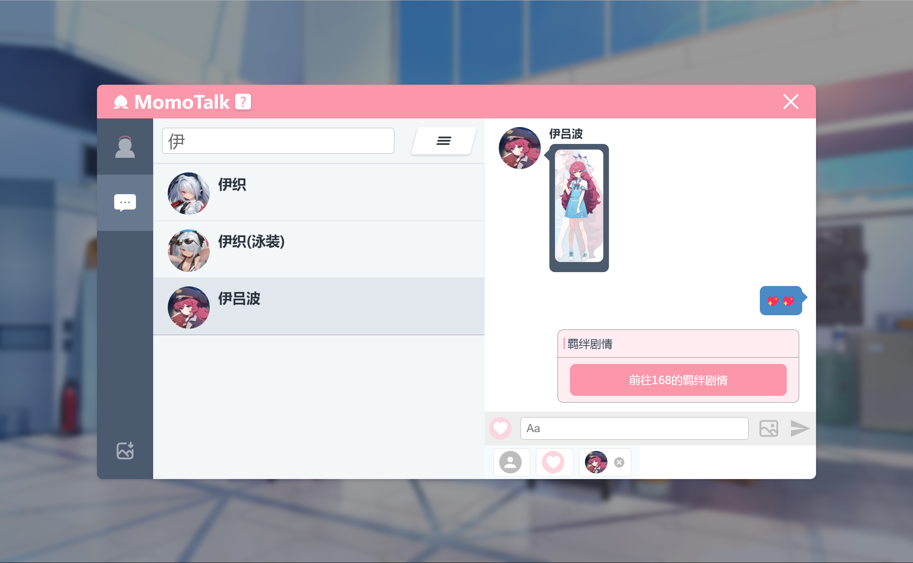

<h1 align="center">Momotalk Editor</h1>

    
    
    

  <strong>A web chat generator, style from Blue Archive</strong> 
  Set your Creative Idea free!

## Preview

## Feature

- **Search** students with name, romaji, and nickname
- **Chat** as Students and Sensei (or send a story box)
- Send the **Image** in chat
- **Delete** any chat box
- Import **Custom** characters
- **Download** the Conversation as an image

[Try it!](https://u1805.github.io/momotalk)

## Star History

## Credits

This project is inspired by:

- [Yuzutalk](https://www.yuzutalk.net/)
- [Slouchwind/momotalk-editor](https://github.com/Slouchwind/momotalk-editor)
- [blacktunes/juus-maker](https://github.com/blacktunes/juus-maker)
- [ClosureTalk/closure-talk](https://github.com/ClosureTalk/closure-talk)

Character metadate from:

- [lonqie/SchaleDB](https://github.com/lonqie/SchaleDB)
- [Ba.Gamekee](https://ba.gamekee.com/)

## Copyrights

Blue Archive avatar and stamp copyrights belong to Yostar & NEXON Games