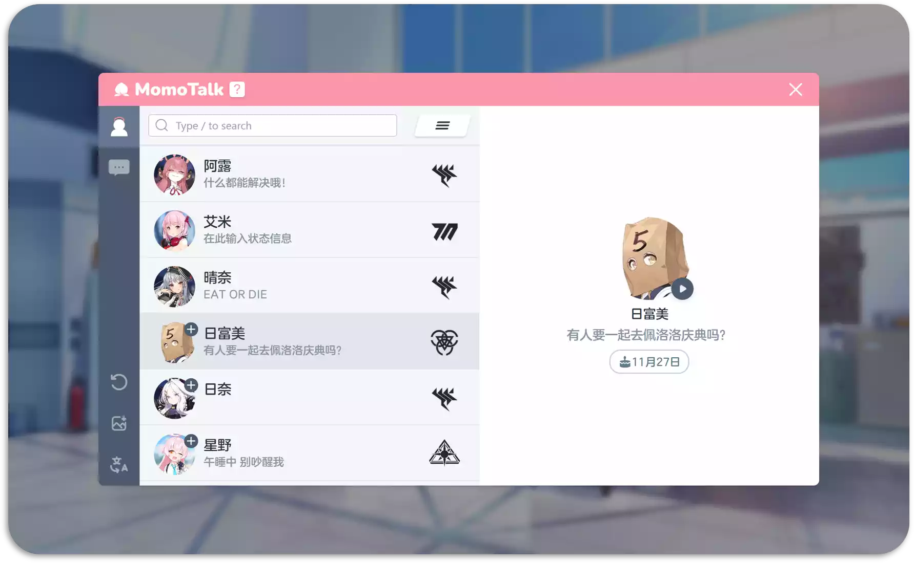

<h1 align="center">MomoTalk 編輯器</h1>

    
    
    

  <strong>一個網頁端的蔚藍檔案聊天對話生成器</strong> 
  來創造腦洞大開的故事吧！

[English](../README.md) | [简体中文](./README-zh_cn.md) | [繁體中文](./README-zh_tw.md) | [日本語](./README-ja.md)

## 特點

- **可搜尋學生**: 能夠透過學生名字、名字羅馬音，甚至暱稱快速搜尋學生. 🔍️
- **自訂角色**: 發言角色包括老師、學生，也可以上傳圖片自訂角色. 🎅
- **訊息類型豐富**: 除了文字還能發送圖片、貼圖(聊天室&角色差分)、選項框和羈絆劇情框. ❤️
- **靈活的編輯**: 聊天框可隨意插入、刪除、編輯、拖曳. 👍
- **方便分享**: 對話可以保存為圖片方便分享給小夥伴. 🖼️
- **保留歷史記錄**: 重啟瀏覽器也可以繼續上一次的對話. 📌
- **多語言支援**: 支援中文（簡體和繁體）、日文、韓文和英文. 🌐
- **MomoTalk 播放器**: 能夠播放遊戲中的 Momotalk 對話劇情. ▶️

[快來試試看！](https://u1805.github.io/momotalk)

## 實驗特性

> 這部分特性功能仍不穩定

- **A.R.O.N.A**: 提供與虛擬助手彩奈(阿洛娜)的互動體驗. 💬

## 預覽

## 使用方法

[HOW TO USE](./How-to-use-zh_tw.md)

## 給個星星

## 感謝

專案參考自:

- [Yuzutalk](https://www.yuzutalk.net/)
- [Slouchwind/momotalk-editor](https://github.com/Slouchwind/momotalk-editor)
- [blacktunes/juus-maker](https://github.com/blacktunes/juus-maker)
- [ClosureTalk/closure-talk](https://github.com/ClosureTalk/closure-talk)

角色數據來源:

- [lonqie/SchaleDB](https://github.com/lonqie/SchaleDB)
- [bluearchive.fandom](https://bluearchive.fandom.com)
- [kivo.wiki](https://kivo.wiki/)
- [ba.gamekee](https://ba.gamekee.com/)

AI 彩奈提示詞：

- [ZiChenStudio/ChatGPT-Arona](https://github.com/ZiChenStudio/ChatGPT-Arona)

## 版權聲明

本專案與 Yostar & NEXON Games 無關。

專案中使用的所有角色信息和素材版權均屬於各自作者。